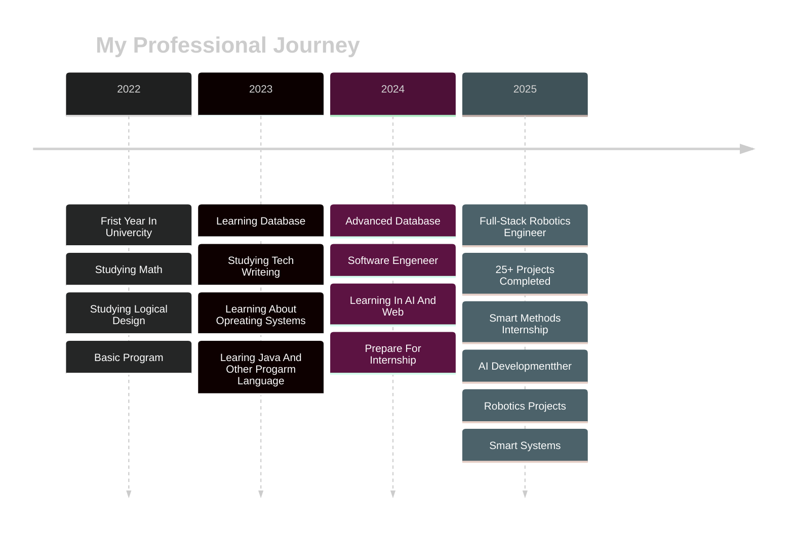

<div align="center">
  
<!-- Animated Header -->


<!-- Typing SVG -->
<p align="center">
  
</p>

<!-- Animated GIF/Banner -->


<!-- Profile Views & Followers -->
<p align="center">
  
  
  
</p>

</div>

---

<div align="center">

## 🎯 About Me


</div>

```python
class KhaledSulaimani:
    def __init__(self):
        self.name = "Khaled Mahmoud Sulaimani"
        self.role = "Full-Stack Robotics Engineer"
        self.education = "Computer Science @ Umm Al-Qura University (4th Year)"
        self.location = "Makkah, Saudi Arabia 🇸🇦"
        self.portfolio = "https://ksx.life"
        
    def current_work(self):
        return {
            "specialization": ["Robotics", "AI/ML", "IoT", "Web Development"],
            "focus": "Bridging software and hardware innovation",
            "experience": "6+ months professional experience",
            "projects_completed": "15+",
            "technologies_mastered": "Full-Stack + Hardware"
        }
    
    def expertise(self):
        return [
            "🤖 Robotics Engineering (Arduino, ESP32)",
            "🧠 Artificial Intelligence & Machine Learning",
            "🌐 Full-Stack Web Development",
            "📱 Mobile App Development (Flutter)",
            "⚙️ SolidWorks & Mechanical Design",
            "🔌 IoT Systems & Hardware Integration",
            "👁️ Computer Vision & Face Recognition"
        ]
```

<div align="center">


### 🌟 Quick Facts

</div>

<table>
<tr>
<td width="50%" valign="top">


</td>
<td width="50%" valign="top">

- 🎓 **4th Year CS Student** at Umm Al-Qura University
- 🏢 **Smart Methods Internship** - 6 Months (AI, Robotics, Smart Systems)
- 💼 Currently open for **exciting opportunities**
- 🔭 Working on **AI-powered robotics projects**
- 🌱 Learning **Advanced AI/ML & Computer Vision**
- 🎯 Passionate about **Hardware + Software Integration**
- 🛠️ Love building **Arduino & ESP32 projects**
- 📐 Skilled in **SolidWorks** for mechanical design
- 🤝 Open to **collaborate on innovative projects**
- 📧 Reach me: **khaled.sul2004@gmail.com**
- ⚡ Fun fact: **100% Client Satisfaction Rate!**

</td>
</tr>
</table>

---

## 🚀 Featured Projects

<div align="center">

<!-- Animated Projects Header -->


<table>
<tr>
<td width="50%" valign="top">

<div align="center">

### 🤖 Face Recognition LED Trigger
**AI-powered face detection using HuskyLens & Arduino**

</div>

**⚡ Tech Stack:**
- 🔹 Arduino UNO
- 🔹 HuskyLens AI Camera
- 🔹 Computer Vision
- 🔹 IoT Integration

<div align="center">

[](https://github.com/khaledsulimani/huskylens)


</div>

</td>
<td width="50%" valign="top">

<div align="center">

### 💬 Chatbot App
**Modern conversational AI with Flutter**

</div>

**⚡ Tech Stack:**
- 🔹 Flutter & Dart
- 🔹 Advanced NLP
- 🔹 Real-time AI
- 🔹 Beautiful UI

<div align="center">

[](https://github.com/khaledsulimani/chatbot-app)


</div>

</td>
</tr>

<tr>
<td width="50%" valign="top">

<div align="center">

### 🦾 Robot Arm Control (Flutter)
**Complete mobile app for 4-motor robot arm control**

</div>

**⚡ Tech Stack:**
- 🔹 Flutter & Dart
- 🔹 PHP Backend
- 🔹 MySQL Database
- 🔹 Real-time Controls

<div align="center">

[](https://github.com/khaledsulimani/robot-arm-flutter)


</div>

</td>
<td width="50%" valign="top">

<div align="center">

### 🧩 Sudoku Solver Analyzer
**AI-powered Sudoku solver with detailed analysis**

</div>

**⚡ Tech Stack:**
- 🔹 Python
- 🔹 AI Algorithms
- 🔹 Advanced Logic
- 🔹 User-friendly UI

<div align="center">

[](https://github.com/khaledsulimani/Sudoku-Solver-Analyzer)


</div>

</td>
</tr>

<tr>
<td width="50%" valign="top">

<div align="center">

### 🌐 Web Robot Arm Control
**6-motor robot arm control via web interface**

</div>

**⚡ Tech Stack:**
- 🔹 HTML/CSS/JS
- 🔹 PHP Backend
- 🔹 MySQL
- 🔹 Real-time Sliders

<div align="center">

[](https://github.com/khaledsulimani/control-servo-via-php)


</div>

</td>
<td width="50%" valign="top">

<div align="center">

### 🚗 Smart RC Car
**Autonomous obstacle avoidance RC car**

</div>

**⚡ Tech Stack:**
- 🔹 Arduino
- 🔹 L293D Motor Driver
- 🔹 Ultrasonic Sensor
- 🔹 C++ Programming

<div align="center">

[](https://github.com/khaledsulimani/l293d)


</div>

</td>
</tr>

<tr>
<td width="50%" valign="top">

<div align="center">

### 🎙️ AI Voice Assistant (Arabic)
**Intelligent Arabic voice assistant**

</div>

**⚡ Tech Stack:**
- 🔹 Python
- 🔹 Cohere AI
- 🔹 Speech Recognition
- 🔹 gTTS & NLP

<div align="center">

[](https://github.com/khaledsulimani/ai_voicechat)


</div>

</td>
<td width="50%" valign="top">

<div align="center">

### 🌟 More Projects
**Check out my repositories for more!**

</div>

**🎯 15+ Projects Completed:**
- 🔹 IoT Systems
- 🔹 Web Applications
- 🔹 AI Solutions
- 🔹 Hardware Projects

<div align="center">

[](https://github.com/khaledsulimani?tab=repositories)


</div>

</td>
</tr>
</table>


</div>

---

## 💻 Tech Stack & Skills

<div align="center">

### 🎨 Frontend Development


### 🔧 Backend Development


### 🗄️ Databases


### 🤖 AI/ML & Computer Vision


### ⚙️ Hardware & IoT


### 🛠️ Design & CAD


### 🔨 Tools & Platforms


</div>

---

## 📊 GitHub Stats

<div align="center">
  
<!-- GitHub Stats Card -->


<!-- GitHub Streak Stats -->


</div>

<div align="center">
  
<!-- Top Languages -->


<!-- GitHub Activity Graph -->


</div>

<div align="center">

<!-- Contribution Snake Animation -->
<picture>
  <source media="(prefers-color-scheme: dark)" srcset="https://raw.githubusercontent.com/khaledsulimani/khaledsulimani/output/github-contribution-grid-snake-dark.svg">
  <source media="(prefers-color-scheme: light)" srcset="https://raw.githubusercontent.com/khaledsulimani/khaledsulimani/output/github-contribution-grid-snake.svg">
  
</picture>

</div>

---

## 🏆 GitHub Trophies

<div align="center">
  
[](https://github.com/ryo-ma/github-profile-trophy)

</div>

---

## 💼 Professional Experience

<div align="center">



</div>

### 🎯 Smart Methods Internship (6 Months)
- 🤖 Developed AI-powered robotics solutions
- 🧠 Worked on cutting-edge smart systems
- 💡 Gained hands-on experience in real-world projects
- 🏆 Received excellent recommendations from CTO & CEO

---

## 🌟 Testimonials

<div align="center">

> *"Khaled's work on the face recognition project was outstanding. His attention to detail and technical expertise really impressed our team."*  
> **— Eng. Wesam Munshi, CEO Smart Methods**

> *"Professional, creative, and delivers excellent results. Khaled's AI projects are innovative and well-executed."*  
> **— Eng. Asma Duramae, CTO Smart Methods**

> *"Great collaboration skills and deep understanding of computer vision technologies. Highly recommended!"*  
> **— Eng. Qusai Masri, Sales Manager 3Dit Corp**

</div>

---

## 🎓 Education & Credentials

<div align="center">

### 🎓 Education
**Bachelor of Computer Science**  
Umm Al-Qura University, Al-Qunfudah Branch  
*Fourth Year Student*

### 📜 Certifications
[](https://drive.google.com/drive/folders/1-1ewuCXAXyUwzEJfnuHqZJsY4CbxIApS?usp=drive_link)

**Industry-recognized certificates in:**
- Technical Expertise
- Programming & Development
- Specialized Skills
- Continuous Learning

</div>

---

## 📫 Connect With Me

<div align="center">

[](https://ksx.life)
[](https://github.com/khaledsulimani)
[](https://www.linkedin.com/in/khaledsulaimaniksx/)
[](mailto:khaled.sul2004@gmail.com)
[](https://www.instagram.com/dixtrr)
[](tel:+966053663315)

### 📍 Location: Makkah, Saudi Arabia 🇸🇦

</div>

---

## 🎯 What I'm Looking For

<div align="center">

```ascii
╔══════════════════════════════════════════════════════════╗
║                                                          ║
║  🚀 Open to Full-Time Opportunities                     ║
║  🤝 Available for Freelance Projects                    ║
║  💡 Interested in Collaboration on Innovative Ideas     ║
║  🎓 Always Learning & Growing                           ║
║  🌍 Remote & On-site Opportunities Welcome              ║
║                                                          ║
╚══════════════════════════════════════════════════════════╝
```

</div>

---

## 💡 My Approach

<div align="center">

<table>
<tr>
<td align="center" width="25%">

<br><b>Innovation</b>
<br>Thinking outside the box
</td>
<td align="center" width="25%">

<br><b>Quality</b>
<br>100% client satisfaction
</td>
<td align="center" width="25%">

<br><b>Learning</b>
<br>Continuous improvement
</td>
<td align="center" width="25%">

<br><b>Collaboration</b>
<br>Team player mindset
</td>
</tr>
</table>

</div>

---

## 📈 Contribution Activity

<div align="center">

<!-- 3D Contribution Graph -->


</div>

---

## 🎮 Fun Zone

<div align="center">

### 🐍 Watch The Snake Eat My Contributions!

<!-- Snake Animation - Make sure to set up GitHub Actions for this -->
<picture>
  <source media="(prefers-color-scheme: dark)" srcset="https://raw.githubusercontent.com/khaledsulimani/khaledsulimani/output/github-contribution-grid-snake-dark.svg">
  
</picture>

### 😄 Random Dev Joke


### 📅 Profile Stats


</div>

---

## 🎨 Skills Visualization

<div align="center">

```text
Robotics Engineering    ████████████████████░   95%
Artificial Intelligence ███████████████████░░   90%
IoT Development        ████████████████████░   92%
Web Development        ██████████████████░░░   88%
Mobile Development     ██████████████████░░░   85%
Hardware Integration   ████████████████████░   93%
Computer Vision        ███████████████████░░   87%
SolidWorks & CAD       ██████████████████░░░   86%
Database Management    ████████████████░░░░░   82%
Problem Solving        ████████████████████░   98%
```

</div>

---

## 🌐 Portfolio Highlights

<div align="center">

### 🎯 Check Out My Full Portfolio
[](https://ksx.life)

**What You'll Find:**
- 📂 Complete project showcase
- 🎓 Educational background
- 📜 Certifications & credentials  
- 💼 Professional experience
- 👥 Client testimonials
- 📧 Contact information

</div>

---

<div align="center">

### 💭 Quote of the Day


---

### 🔥 Closing Statement

```ascii
╔═══════════════════════════════════════════════════════════════╗
║                                                               ║
║   "Bridging the gap between imagination and innovation       ║
║    through the perfect harmony of software and hardware."    ║
║                                                               ║
║                 - Khaled Mahmoud Sulaimani                    ║
║                                                               ║
╚═══════════════════════════════════════════════════════════════╝
```

### ⚡ Current Status: Building the Future, One Line of Code at a Time


---

<p align="center">
  
</p>

<p align="center">
  <b>⭐️ From <a href="https://github.com/khaledsulimani">Khaled Sulaimani</a> | Crafted with ❤️ and ☕</b>
</p>

<p align="center">
  <sub>Last Updated: October 2025</sub>
</p>


</div>
